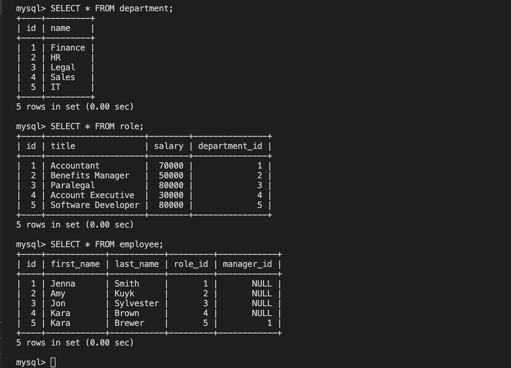

# Employee Tracker

## Contents

  - [User Story](#user_story)
  - [Acceptance Criteria](#acceptance_criteria)
  - [Installation](#installation)
  - [Usage](#usage)
  - [Contributing](#contributing)
  - [Tests](#tests)
  - [License](#license)
  - [Attributions](#attributions)
  - [Questions](#questions)

## User Story

````
AS A business owner
I WANT to be able to view and manage the departments, roles, and employees in my company
SO THAT I can organize and plan my business
````

## Acceptance Criteria

````
GIVEN a command-line application that accepts user input
WHEN I start the application
THEN I am presented with the following options: view all departments, view all roles, view all employees, add a department, add a role, add an employee, and update an employee role
WHEN I choose to view all departments
THEN I am presented with a formatted table showing department names and department ids
WHEN I choose to view all roles
THEN I am presented with the job title, role id, the department that role belongs to, and the salary for that role
WHEN I choose to view all employees
THEN I am presented with a formatted table showing employee data, including employee ids, first names, last names, job titles, departments, salaries, and managers that the employees report to
WHEN I choose to add a department
THEN I am prompted to enter the name of the department and that department is added to the database
WHEN I choose to add a role
THEN I am prompted to enter the name, salary, and department for the role and that role is added to the database
WHEN I choose to add an employee
THEN I am prompted to enter the employee’s first name, last name, role, and manager, and that employee is added to the database
WHEN I choose to update an employee role
THEN I am prompted to select an employee to update and their new role and this information is updated in the database
````
## Installation

Run the following command in your terminal in order to install all the packages:

`npm install`

Run the following commands in get mysql up and running: 

`mysql -u root -p` and enter your password.

Run the following commands in the mysql server: 

1. `source db/schema.sql` to create database.

2. `source db/seeds.sql` to seed the database.

Start the node application by running: 

`node server.js`

and follow the user prompts to run through the application.

Run commands in order to view database: 

SELECT * FROM department;

SELECT * FROM role;

SELECT * FROM employee;

## Usage



Link to [walkthrough](https://youtu.be/73yaXTDskzo) video.

## Contributing

In order to contribute, create a pull request and follow the steps listed below:

- Fork the repo
- Create a feature branch (git checkout -b NAME-HERE)
- Commit your new feature (git commit -m 'Add some feature')
- Push your branch (git push)
- Create a new Pull Request

Following a code review, your feature will be merged.

## Tests

No testing protocols were implemented in this application

## License

[](https://opensource.org/licenses/MIT)

This application is licensed under the MIT License.

## Attributions

* [How to use AUTO INCREMENT](https://www.w3schools.com/sql/sql_autoincrement.asp)
* [switch statements](https://javascript.info/switch)
* [inquirer.js](https://www.npmjs.com/package/inquirer)
* [mysql2](https://www.npmjs.com/package/mysql2)
* [console.table](https://www.npmjs.com/package/console.table)


## Questions

If you have any questions, please contact me at my [email](mailto:leandrikuyk@gmail.com?subject=%20Employee%20Tracker). You can find more of my work on my GitHub at [LeandriB](https://github.com/LeandriB). 

